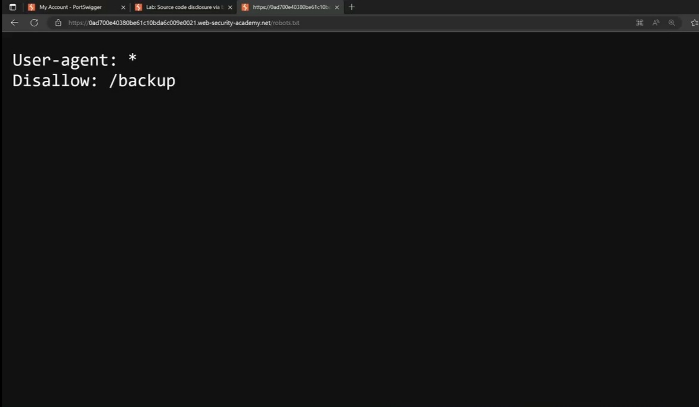
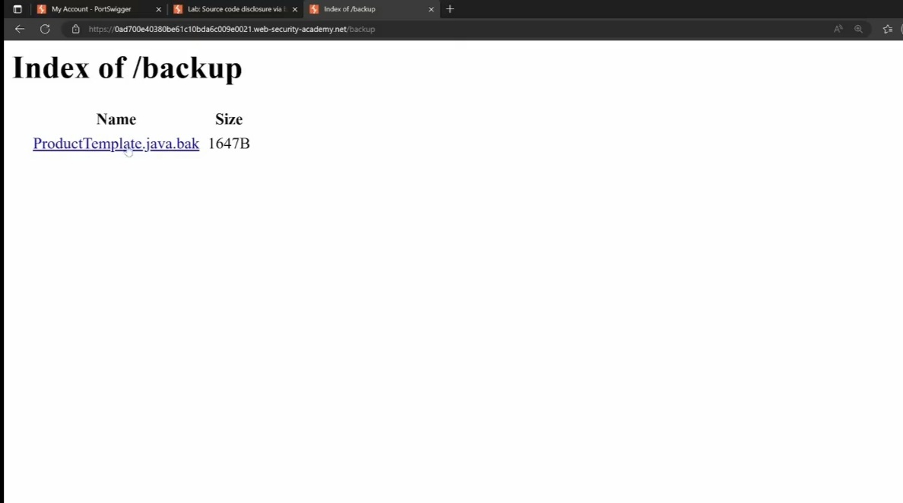

### PORTSWIGGER-LABS ###

This repository contains solutions to all the labs that I solved in the Port Swigger Academy, reports, and screen shots.
Each section represents a main title for OWASP 10. Each of these sections contains the name of the lab, the solution steps, and a screenshot of the solution.

## A1:Broken Access Control
  🖋️**Description**
  🏃‍♀️**Solution steps**
  🖼️**Screenshots**

## A2:Cryptographic Faiures
## 1.information disclouser
## lab(1): source code disclosure via backup files robots.txt

  🖋️**Description**
  
  In this lab I find  bug allowed  leaks sensitive code and information  from a backup file when I type robots.txt on last of URL  
  
  🏃‍♀️**Solution steps**
  
  1.type /robots.txt in last of URL
  
  2.copy /backup section form Disallw:/backup
  
  3.past /backup section in alast of URL 
  
  4.you will see the post grea sql and the password at the bottom of the post grea sql
  
  🖼️**Screenshots**
  
  open robots.txt

  
what in site backup file

  
  (images/Find a password.jpg)

--------------------------------------------------------------------------------------------------------------------------------------------------------
## lab(2):information disclosure on debug page

 🖋️**Description**
  🏃‍♀️**Solution steps**
  🖼️**Screenshots**

## A3:injection

##labe (1)OS command injection simple case 
  
  🖋️**Description**
  
  OS injection its one of injection attack which is targeting  the command  that us in OS server 
  on this lab there are OS command injection on prodect stock checker when i  us burp suite and type  ; uname i can find the OS the type of OS 
  
  🏃‍♀️**Solution steps**
  
  1.open burp suite

  2.accsess to  url labe from burp suite  Browser
  
  3.go to any  prodact and open the the entercept on 
  4.click right clike and choose send to repeater
  4.write ;whoam or uname  after storeTD like storeId;uname or whoami 
  5. click send 
  6.look to the server respons
  
  🖼️**Screenshots**
  
  
